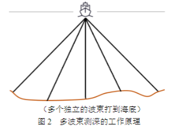
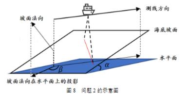

## B题思考

> 如何定量化的表述

*还有的情况是对当前的情况进行数学建模*

### 讨论重复率的问题

多波束测深系统是在单波束测深的基础上发展起来的，该系统在与航迹垂直的平面内一次能发射出数十个乃至上百个波束，再由接收换能器接收由海底返回的声波，其工作原理如图2所示。多波束测深系统克服了单波束测深的缺点，在海底平坦的海域内，能够测量出以测量船测线为轴线且具有一定宽度的全覆盖水深条带（图3）。

> 中心点的定义

$$
W_n = (x_n+y_n)cos\alpha\\
\left \{
\begin{aligned}
x_n=\frac{sin(\frac{\theta}{2})}{sin(\frac{\pi-\theta}{2}-\alpha)}D_n \\
y_n=\frac{sin(\frac{\theta}{2})}{sin(\frac{\pi-\theta}{2}+\alpha)}D_n
\end{aligned}
\right .
$$

## B题问题3描述

在一个2NM * 4NM的海域中找到一个能够覆盖全部海域且路径最短的方法，且满足重复率在10%~20%之间

在一个斜坡上找到相应的算法，能够在保证扫描的情况下进行。

